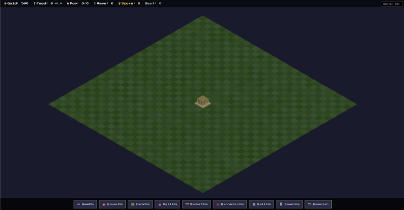

# Massilia

A retro/8-bit isometric Roman city builder inspired by Caesar 2 and SimCity. Built with Three.js + Vite + TypeScript.

**Play now:** [massilia-ten.vercel.app](https://massilia-ten.vercel.app)



## Gameplay

Build and manage a Roman colony. Place buildings to grow your population, manage resources, and defend against barbarian invasions. Control is indirect — buildings produce autonomous walkers and soldiers.

### Buildings

| Building | Cost | Size | Description |
|----------|------|------|-------------|
| Road | 5g | 1x1 | Connects buildings, walker paths |
| House | 30g | 1x1 | Attracts population (needs water + food) |
| Farm | 50g | 2x2 | Produces food |
| Well | 20g | 1x1 | Sends water walkers to service houses |
| Market | 80g | 1x1 | Sends food walkers to service houses |
| Barracks | 100g | 2x2 | Produces soldiers that defend the city |
| Wall | 10g | 1x1 | Blocks invaders, connects visually |
| Tower | 60g | 1x1 | Shoots arrows at invaders in range |

### Controls

- **WASD / Arrow keys** — Pan camera
- **Mouse wheel** — Zoom
- **1-8** — Select building by number
- **Letter keys** — Select building by shortcut (underlined letter)
- **D** — Demolish mode
- **C** — Center camera on forum
- **Space** — Pause
- **Escape** — Deselect
- **Right click** — Deselect
- **Click + drag** — Place roads/walls continuously

### How to Win (You Don't)

Massilia is an endless survival game. Barbarian waves escalate in size and strength. Your score is based on peak population, waves survived, and total gold earned. Survive as long as you can.

## Development

```bash
npm install
npm run dev
```

## Tech Stack

- Three.js (WebGL rendering)
- TypeScript
- Vite (build tool)
- All geometry is box primitives with MeshLambertMaterial for the retro look
- Isometric OrthographicCamera
- Save/load via localStorage
